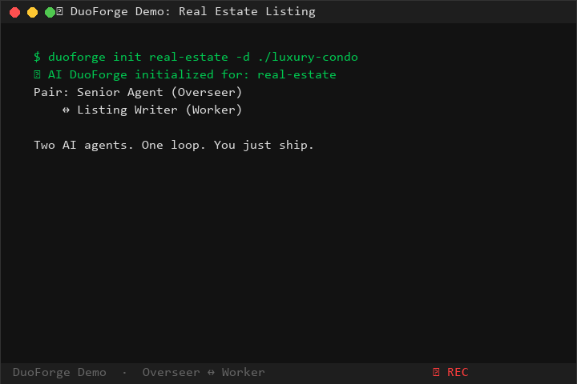
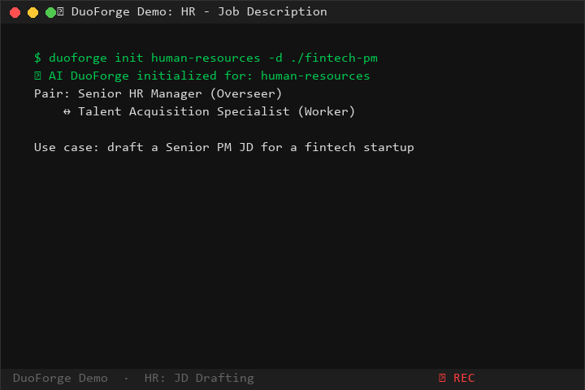

<p align="center">
  <picture>
    <source media="(prefers-color-scheme: dark)" srcset="https://img.shields.io/badge/AI_DuoForge-000000?style=for-the-badge&logo=github&logoColor=white">
    
  </picture>
</p>

<p align="center">
  <em>Two AI agents working together beat one.</em><br>
  <strong>Overseer plans & reviews · Worker executes · They iterate until quality passes</strong>
</p>

<p align="center">
  <strong>No coding required.</strong> Works for any profession, any industry, any language.
</p>

<p align="center">
  <a href="#getting-started"><strong>Getting Started</strong></a> ·
  <a href="#how-it-works"><strong>How It Works</strong></a> ·
  <a href="#for-every-industry"><strong>For Every Industry</strong></a> ·
  <a href="#agent-bridge-protocol"><strong>Protocol</strong></a> ·
  <a href="#configuration"><strong>Config</strong></a>
</p>

<p align="center">
  
  
  
  
</p>

---

<p align="center">
  
  &nbsp;&nbsp;
  
  <br>
  <em>Left: Real Estate — Hermes (Agent) ↔ ClawX (Writer) iterate a luxury condo listing in 73s</em>
  <br>
  <em>Right: HR — Hermes (HR Manager) ↔ ClawX (Talent Specialist) draft a Senior PM JD in 84s</em>
</p>

---

## Why DuoForge?

A single AI agent has one brain. It plans, executes, and reviews — all in the same context window. Confirmation bias kicks in. Token limits hit. Blind spots compound.

**DuoForge splits the mind.**

One agent **oversees** — designs the approach, splits work into tasks, reviews output, demands revisions. The other **executes** — writes, builds, analyzes, drafts. They loop until the overseer signs off. You just ship.

| Working Alone | With DuoForge |
|---|---|
| One mind does everything → context thrashing | Overseer focuses on plan, Worker on execution |
| Self-review misses your own mistakes | Independent reviewer catches what you miss |
| One model's blind spots persist | Two agents cover each other's gaps |
| Hits limits on large tasks | Split across two contexts = 2× effective capacity |

**But here's the key insight:** This isn't about technology. It's about **role separation** — a pattern every industry already uses. A senior partner reviews a junior associate's work. A creative director reviews a copywriter's draft. A chief architect reviews an engineer's blueprint.

DuoForge just automates that loop with AI.

---

## Getting Started

```bash
# Install
pip install ai-duoforge
# or clone
git clone https://github.com/suisui9527/ai-duoforge.git
cd ai-duoforge
pip install -e .

# Initialize a pair session for your domain
duoforge init coding -d ./my-project

# See what domains are available
duoforge list
```

### Run Your First Pair

**1. Open Overseer** (Hermes, Claude Code, ChatGPT with file access, etc.):

```
I'm the OVERSEER in a DuoForge session.
Read .ai-pair/overseer_prompt.md for my role.
Check .ai-pair/session.json for context.
Send tasks to .ai-pair/outbox/ — I review and iterate.
```

**2. Open Worker** (any AI agent in the same directory):

```
I'm the WORKER in a DuoForge session.
Read .ai-pair/worker_prompt.md for my role.
Poll .ai-pair/inbox/ for tasks — I execute, return results.
```

**3. Watch them iterate.** Overseer sends tasks, Worker executes, Overseer reviews and either accepts or sends back with feedback. Loop until done.

---

## How It Works

```
                    ┌─────────────────────┐
                    │    DuoForge CLI      │
                    │  duoforge init/start │
                    └─────────┬───────────┘
                              │
              ┌───────────────┴───────────────┐
              ▼                               ▼
      ┌───────────────┐             ┌───────────────┐
      │   Overseer    │◄────JSON────│    Worker     │
      │  (Agent A)    │──messages──►│   (Agent B)   │
      └───────┬───────┘             └───────┬───────┘
              │                             │
              └───────────┬─────────────────┘
                          │
                  ┌───────┴───────┐
                  │ Agent Bridge  │
                  │ (File/HTTP)   │
                  └───────────────┘
```

The iteration loop:

```
You         Overseer     Worker
 │             │            │
 ├─ ask for something       │
 │             │            │
 │             ├─ task ────►│
 │             │            ├── execute
 │             │◄── result ─┤
 │             │            │
 │             ├─ review    │
 │     [revise]├─ task v2 ─►│
 │             │            ├── fix & improve
 │             │◄── result ─┤
 │             │            │
 │   [approve] │            │
 ◄── output ───┤            │
```

No server required. No daemon. No dependencies beyond Python.

---

## For Every Industry

DuoForge isn't a coding tool. It's a **general-purpose work automation pattern** that any profession can use.

<details>
<summary><strong>⚖️ Legal</strong> — Draft contracts, review briefs, research case law</summary>

| Role | Overseer | Worker |
|------|----------|--------|
| You | Senior Partner | Junior Associate |
| What they do | Review legal reasoning, check citations, define arguments | Draft briefs, summarize cases, compile evidence |
| Example | "Draft a motion to dismiss based on lack of standing. Cite three relevant precedents." | Produces the draft. Partner reviews for logic and completeness. Loops until court-ready. |

</details>

<details>
<summary><strong>🏥 Healthcare</strong> — Compile patient reports, research treatments, write discharge summaries</summary>

| Role | Overseer | Worker |
|------|----------|--------|
| You | Chief Physician | Resident / Researcher |
| What they do | Diagnose, define treatment plan, review patient summary | Gather patient history, compile lab results, draft reports |
| Example | "Summarize this patient's case for the morning handoff. Include vitals trends and pending labs." | Drafts summary. Physician reviews and corrects before sign-off. |

</details>

<details>
<summary><strong>💰 Finance & Accounting</strong> — Reconcile accounts, draft reports, analyze P&L</summary>

| Role | Overseer | Worker |
|------|----------|--------|
| You | CFO / Controller | Analyst / Accountant |
| What they do | Review reports, identify risks, define methodology | Crunch numbers, build spreadsheets, prepare statements |
| Example | "Run a variance analysis on Q3 vs Q2 by department. Flag anything >10%." | Produces analysis with notes. CFO reviews and adds commentary. |

</details>

<details>
<summary><strong>📢 Marketing & Advertising</strong> — Campaign strategy, copywriting, A/B test analysis</summary>

| Role | Overseer | Worker |
|------|----------|--------|
| You | Marketing Director | Copywriter / Designer |
| What they do | Define brand voice, set strategy, review output | Write copy, design assets, analyze campaign data |
| Example | "Write three variants of an Instagram ad for our new product launch. Tone: playful but premium." | Drafts three options. Director picks winner, requests revisions on the rest. |

</details>

<details>
<summary><strong>🎓 Education</strong> — Lesson plans, curriculum design, student assessments</summary>

| Role | Overseer | Worker |
|------|----------|--------|
| You | Curriculum Designer | Teaching Assistant |
| What they do | Define learning objectives, review content | Create lesson materials, write quizzes, compile resources |
| Example | "Design a 4-week module on climate change for 9th graders. Include 3 hands-on activities per week." | Produces module. Designer reviews for age-appropriateness and accuracy. |

</details>

<details>
<summary><strong>📰 Journalism & Media</strong> — Research, draft, fact-check articles</summary>

| Role | Overseer | Worker |
|------|----------|--------|
| You | Editor-in-Chief | Reporter |
| What they do | Define story angle, assign beats, verify facts | Gather sources, interview subjects, write drafts |
| Example | "Write a 1000-word feature on the impact of AI on small businesses. Interview at least 3 sources." | Drafts the piece. Editor reviews for accuracy, tone, and narrative flow. |

</details>

<details>
<summary><strong>🏗️ Architecture & Construction</strong> — Review plans, compile specs, draft proposals</summary>

| Role | Overseer | Worker |
|------|----------|--------|
| You | Lead Architect | Drafter / Intern |
| What they do | Review designs, check building codes, define specs | Create CAD drafts, compile material lists, research codes |
| Example | "Draft a material specification sheet for this commercial project. Include local code compliance notes." | Produces spec sheet. Lead architect reviews and stamps. |

</details>

<details>
<summary><strong>🛒 E-commerce & Retail</strong> — Product descriptions, inventory analysis, customer segmentation</summary>

| Role | Overseer | Worker |
|------|----------|--------|
| You | Product Manager | Listing Writer |
| What they do | Define product positioning, review listings | Write descriptions, optimize for SEO, analyze sales data |
| Example | "Write product descriptions for our new spring collection. 50 SKUs. Highlight sustainable materials." | Produces all 50 descriptions. PM reviews for consistency and brand voice. |

</details>

<details>
<summary><strong>🎮 Game Development</strong> — Design docs, level scripts, QA reports</summary>

| Role | Overseer | Worker |
|------|----------|--------|
| You | Game Director | Developer / Level Designer |
| What they do | Define mechanics, review builds, set quality gates | Implement features, script levels, run tests |
| Example | "Design a stealth mechanic for Act 3. Must integrate with existing guard AI." | Implements and documents. Director plays and sends feedback. Iterates until it feels right. |

</details>

<details>
<summary><strong>🏢 Real Estate</strong> — Property comps, listing descriptions, market analysis</summary>

| Role | Overseer | Worker |
|------|----------|--------|
| You | Broker / Agent | Assistant / Analyst |
| What they do | Price properties, review listings, advise clients | Compile comps, write MLS descriptions, research market trends |
| Example | "Write a compelling listing description for this downtown condo. Highlight the view, location, and recent renovations." | Drafts description. Agent reviews from the client's perspective. |

</details>

<details>
<summary><strong>📊 Human Resources</strong> — Job descriptions, interview questions, offer letters</summary>

| Role | Overseer | Worker |
|------|----------|--------|
| You | HR Manager | Recruiter / Coordinator |
| What they do | Define role requirements, review candidates | Write descriptions, screen resumes, draft offer letters |
| Example | "Write a job description for a Senior Data Engineer. Include 5 must-have requirements and 3 nice-to-haves." | Drafts JD. Manager reviews for accuracy and compliance. |

</details>

<details>
<summary><strong>🔬 Research & Academia</strong> — Literature reviews, grant proposals, experiment design</summary>

| Role | Overseer | Worker |
|------|----------|--------|
| You | Principal Investigator | Research Assistant |
| What they do | Define research questions, review methods, check results | Gather papers, run analyses, draft sections |
| Example | "Review the last 3 years of literature on CRISPR applications in oncology. Synthesize into a 2-page summary." | Produces review with citations. PI checks for gaps and interpretation errors. |

</details>

<details>
<summary><strong>💼 Consulting</strong> — Client decks, market analysis, recommendation reports</summary>

| Role | Overseer | Worker |
|------|----------|--------|
| You | Partner / Engagement Manager | Consultant / Analyst |
| What they do | Define framework, review deliverables, manage client | Research, build decks, run analysis, draft recommendations |
| Example | "Build a competitive landscape analysis for our fintech client. 10 competitors, 5 dimensions." | Produces the analysis. Partner reviews for strategic insight before client delivery. |

</details>

<details>
<summary><strong>🌐 Translation & Localization</strong> — Document translation, glossary management, QA</summary>

| Role | Overseer | Worker |
|------|----------|--------|
| You | Localization QA Lead | Translator |
| What they do | Define glossary, review translations, check consistency | Translate text, flag ambiguities, maintain term base |
| Example | "Translate this 20-page user manual into Japanese. Follow the established glossary. Flag any ambiguous terms." | Produces translation. QA reviews for accuracy, consistency, and natural flow. |

</details>

<details>
<summary><strong>🧑‍💻 Software Development</strong> — Feature implementation, code review, bug fixes</summary>

| Role | Overseer | Worker |
|------|----------|--------|
| You | Senior Architect | Developer |
| What they do | Design architecture, review code, set standards | Write features, add tests, fix bugs |
| Example | "Implement a rate limiter middleware. Must support Redis backend and configurable limits per route." | Writes code with tests. Architect reviews for performance and edge cases. |

</details>

---

## Agent Bridge Protocol

Under the hood, agents communicate via **Agent Bridge Protocol v1 (ABP)** — a lightweight, transport-agnostic message format anyone can use.

```json
{
  "version": "abp/v1",
  "id": "msg_1780954000_a1b2",
  "from": "hermes",
  "to": "clawx",
  "type": "task",
  "payload": { "goal": "Draft a motion to dismiss" },
  "timestamp": "2026-06-09T10:00:00Z"
}
```

### Message Types

| Type | Purpose | Example |
|---|---|---|
| `task` | Request work | "Review these 10 contracts" |
| `result` | Return output | "Done, 3 contracts need revision" |
| `ack` | Acknowledge receipt | "Got it, working on it" |
| `ping/pong` | Liveness check | Heartbeat |
| `context` | Share knowledge | "Client preference: concise" |
| `train` | Send feedback | "Use more citations" |
| `announce` | Register presence | "Hermes online" |

### Transports

- **File** — Zero deps, JSON files in a shared directory. Works with any agent.
- **HTTP** — REST endpoints for remote agents across the network.
- **MCP** — Native integration with Hermes Agent, Claude Code, Cursor.
- **STDIO** — Pipe-friendly, for chained CLI tools.
- **Shell** — 100-line bash client in `bridge/implementations/cli/abp.sh`.

```bash
# Send a task
export ABP_AGENT_NAME="hermes"
bash bridge/implementations/cli/abp.sh send clawx task \
  '{"goal":"Summarize this quarter's results"}'

# Check for replies
bash bridge/implementations/cli/abp.sh poll
```

---

## Configuration

### Domain Configs

Each domain is a YAML file with role descriptions, personas, and quality gates.

```yaml
# configs/legal.yaml
domain: legal
description: "Draft and review legal documents"

quality_gates:
  - "All citations are real and accurate"
  - "Legal reasoning is sound"
  - "No contradictory arguments"
  - "Format follows court rules"

pair:
  overseer:
    persona: >
      You are a Senior Partner reviewing legal work. You check
      every citation, challenge weak arguments, and ensure the
      logic holds. You NEVER draft documents directly.
    review_criteria:
      - "Cases cited are on point"
      - "Arguments follow from facts"
      - "No logical holes or contradictions"

  worker:
    persona: >
      You are a Junior Associate. You receive clear instructions
      from the Partner and produce drafts with proper citations.
      You don't change strategy — you execute precisely.
    output_format: |
      Well-formatted legal document with citations.
```

### Add Custom Domains

```bash
# Copy an existing config and customize
cp configs/coding.yaml configs/my-industry.yaml

# Edit domain name, personas, and quality gates
# then initialize:
duoforge init my-industry -d ./my-project
```

---

## Supported Agent Pairs

| Overseer | Worker | Best For |
|---|---|---|
| Hermes Agent | Claude Code | Developers who want precision |
| Hermes Agent | Codex CLI | Quick prototyping |
| Hermes Agent | ClawX | Quant / analysis workflows |
| Claude Code | Codex CLI | Heavy engineering |
| ChatGPT | Claude Code | Non-technical users, any industry |
| Any AI | Any AI | Whatever you dream up |

DuoForge works with **any AI agent** that can read and write files. If your agent can run a prompt, it can participate.

---

## Project Structure

```
ai-duoforge/
├── duoforge/                     # Python CLI
│   ├── __init__.py
│   └── cli.py                    # init, list, inspect commands
├── configs/                      # Domain configurations
│   ├── coding.yaml
│   ├── analysis.yaml
│   ├── writing.yaml
│   ├── translation.yaml
│   └── research.yaml
├── bridge/                       # Agent Bridge Protocol
│   ├── spec/SPEC.md              # Full protocol specification
│   └── implementations/
│       ├── file-bridge/          # Python file transport CLI
│       ├── cli/abp.sh            # Zero-dep shell client
│       └── hermes-skill/         # Hermes Agent integration
├── examples/                     # Guides and tutorials
│   ├── quickstart.md
│   ├── two-agent-chat.md
│   └── self-hosted-demo.md
├── .github/workflows/ci.yml      # CI pipeline
├── pyproject.toml                # Package config
└── README.md
```

---

## Roadmap

- [x] CLI: `init`, `list`, `inspect` commands
- [x] 5 built-in domain configs with personas + quality gates
- [x] Agent Bridge Protocol v1 specification
- [x] File transport (Python + shell)
- [x] GitHub CI pipeline
- [ ] **PyPI publish** — one-command install for everyone
- [ ] `duoforge start` — auto-launch both agents in a session
- [ ] HTTP transport server — agents across machines
- [ ] MCP transport server — deep IDE integration
- [ ] Web dashboard — see pair sessions in real time
- [ ] Template marketplace — share domain configs with the community

---

## License

MIT — Free for any use, commercial or personal. No strings attached.

---

<p align="center">
  Created by <a href="https://github.com/suisui9527">suisui9527</a> ·
  <a href="https://github.com/suisui9527/ai-duoforge/issues">Report an Issue</a> ·
  <a href="https://github.com/suisui9527/ai-duoforge/discussions">Join the Discussion</a>
</p>
